# TRỰC QUAN HÓA CÁC THUẬT TOÁN TRÍ TUỆ NHÂN TẠO QUA BÀI TOÁN 8-PUZZLE

Bài toán 8-Puzzle là một bài toán trí tuệ cổ điển, trong đó người chơi cần sắp xếp lại các ô số từ 1 đến 8 trên một bảng 3x3 về đúng vị trí của chúng, với một ô trống để di chuyển. Dự án này triển khai và trực quan hóa nhiều thuật toán AI khác nhau để giải quyết bài toán này một cách tự động.

## MỤC TIÊU DỰ ÁN

1. **Tự động hóa giải pháp:** Xây dựng một hệ thống có khả năng tự động tìm ra chuỗi các bước di chuyển tối ưu từ trạng thái ban đầu đến trạng thái mục tiêu của bài toán 8-Puzzle.

2. **Triển khai đa dạng thuật toán:** Áp dụng và so sánh hiệu quả của nhiều thuật toán AI khác nhau trong việc giải quyết bài toán, bao gồm các phương pháp tìm kiếm có thông tin và không có thông tin.

3. **Phân tích hiệu suất:** Đánh giá và so sánh hiệu suất của các thuật toán dựa trên các tiêu chí như thời gian thực thi, số bước di chuyển, và số lượng trạng thái đã khám phá.

4. **Giáo dục và nghiên cứu:** Cung cấp một công cụ trực quan để học tập và nghiên cứu về các thuật toán tìm kiếm trong AI, với khả năng theo dõi từng bước thực hiện của thuật toán.

## CẤU TRÚC DỰ ÁN

### 1. Cài đặt bài toán 8-Puzzle

- **Lớp PuzzleState:** Biểu diễn trạng thái của bảng 8-Puzzle
  - Lưu trữ ma trận 3x3 và vị trí ô trống
  - Cung cấp các phương thức để tạo và quản lý trạng thái
  - Tính toán các trạng thái kế tiếp có thể có
  - Đánh giá heuristic cho trạng thái hiện tại

- **Các thao tác cơ bản:**
  - Xác định vị trí ô trống
  - Thực hiện các bước di chuyển hợp lệ
  - Kiểm tra tính khả thi của trạng thái
  - Tính toán khoảng cách giữa các trạng thái

### 2. Các thuật toán tìm kiếm

#### 2.1. Tìm kiếm không có thông tin (Uninformed Search)

Các thuật toán trong nhóm này thực hiện tìm kiếm mà không sử dụng bất kỳ thông tin bổ sung nào về khoảng cách hoặc chi phí ước lượng đến đích. Chúng chỉ dựa vào cấu trúc của không gian tìm kiếm.

*   **Các thành phần cơ bản:**
    *   **Trạng thái:** Cấu hình hiện tại của bảng 8-Puzzle
    *   **Trạng thái ban đầu:** [[2, 6, 5], [0, 8, 7], [4, 3, 1]]
    *   **Trạng thái đích:** [[1, 2, 3], [4, 5, 6], [7, 8, 0]]
    *   **Các hành động:** Di chuyển ô trống (lên, xuống, trái, phải)
    *   **Mô hình chuyển đổi:** Quy tắc xác định trạng thái mới sau mỗi hành động
    *   **Chi phí đường đi:** Số bước di chuyển từ trạng thái ban đầu
    *   **Lời giải:** Chuỗi các hành động dẫn đến trạng thái đích

*   **Các thuật toán đã triển khai:**
    *   **BFS (Breadth-First Search):** Sử dụng hàng đợi (deque) để lưu trữ và xử lý các trạng thái theo thứ tự ưu tiên theo độ sâu. Mỗi phần tử trong hàng đợi chứa thông tin về trạng thái hiện tại và đường đi đã thực hiện. Thuật toán duy trì một tập hợp các trạng thái đã thăm để tránh lặp lại. Tại mỗi bước, thuật toán lấy trạng thái đầu tiên từ hàng đợi, kiểm tra mục tiêu, và thêm các trạng thái kế tiếp chưa thăm vào hàng đợi. Đảm bảo tìm được đường đi ngắn nhất.
    
    *   **DFS (Depth-First Search):** Sử dụng ngăn xếp để lưu trữ các trạng thái cần xử lý. Mỗi phần tử trong ngăn xếp chứa thông tin về trạng thái hiện tại, đường đi và độ sâu. Thuật toán có giới hạn độ sâu tối đa (50) để tránh lặp vô tận. Tại mỗi bước, thuật toán lấy trạng thái trên cùng của ngăn xếp, kiểm tra mục tiêu, và thêm các trạng thái kế tiếp chưa thăm vào ngăn xếp nếu chưa đạt giới hạn độ sâu.
    
    *   **UCS (Uniform Cost Search):** Sử dụng hàng đợi ưu tiên để lưu trữ các trạng thái theo chi phí đường đi. Mỗi phần tử trong hàng đợi chứa thông tin về chi phí, trạng thái và đường đi. Chi phí được tính bằng số bước di chuyển từ trạng thái ban đầu. Thuật toán duy trì một tập hợp các trạng thái đã thăm. Tại mỗi bước, thuật toán lấy trạng thái có chi phí thấp nhất, kiểm tra mục tiêu, và thêm các trạng thái kế tiếp chưa thăm vào hàng đợi với chi phí tương ứng.
    
    *   **IDS (Iterative Deepening Search):** Kết hợp ưu điểm của BFS và DFS bằng cách thực hiện DFS với giới hạn độ sâu tăng dần. Thuật toán bắt đầu với độ sâu 0 và tăng dần cho đến khi tìm thấy giải pháp. Tại mỗi độ sâu, thuật toán sử dụng ngăn xếp để lưu trữ các trạng thái cần xử lý, với mỗi phần tử chứa thông tin về trạng thái, đường đi và độ sâu hiện tại.
    

*   **So sánh hiệu suất:**
    *   **BFS:**
    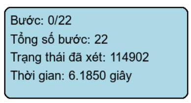

    *   **DFS:**
    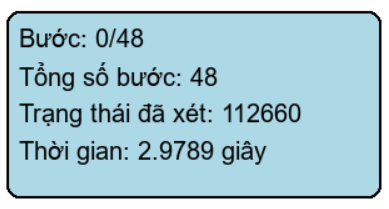

    *   **UCS:**
    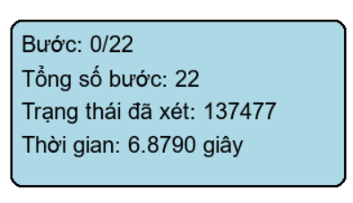

    *   **IDS:**
    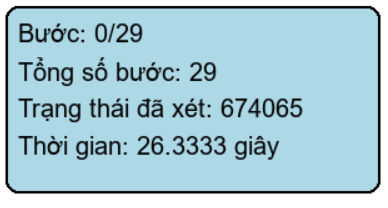

*   **Phân tích hiệu suất:**
    *   **Độ dài đường đi:**
        *   BFS: 22 bước
        *   UCS: 22 bước
        *   IDS: 29 bước
        *   DFS: 48 bước
    *   **Số trạng thái đã xét:**
        *   DFS: 112660 
        *   UCS: 137477
        *   BFS: 114902 
        *   IDS: 674065 
    *   **Thời gian thực thi:**
        *   DFS: 2.9789 giây
        *   BFS: 6.185 giây
        *   UCS: 6.879 giây
        *   IDS: 26.333 giây
    *   **Kết luận:** Các thuật toán BFS, UCS, IDS có số bước gần như bằng nhau và tối ưu số bước hơn DFS. Nhưng trong khi 3 thuật toán còn lại có số bước gần như bằng nhau thì IDS lại có số bước nhiều hơn hẳn. Do đó thời gian thực thi của IDS cũng lâu nhất trong nhóm thuật toán.

#### 2.2. Tìm kiếm có thông tin (Informed Search)

Các thuật toán trong nhóm này sử dụng thông tin bổ sung (hàm heuristic) để hướng dẫn quá trình tìm kiếm, giúp tìm ra giải pháp hiệu quả hơn so với các thuật toán không có thông tin.

*   **Các thành phần cơ bản:**
    *   **Trạng thái:** Cấu hình hiện tại của bảng 8-Puzzle
    *   **Trạng thái ban đầu:** [[2, 6, 5], [0, 8, 7], [4, 3, 1]]
    *   **Trạng thái đích:** [[1, 2, 3], [4, 5, 6], [7, 8, 0]]
    *   **Các hành động:** Di chuyển ô trống (lên, xuống, trái, phải)
    *   **Mô hình chuyển đổi:** Quy tắc xác định trạng thái mới sau mỗi hành động
    *   **Chi phí đường đi:** Số bước di chuyển từ trạng thái ban đầu
    *   **Hàm heuristic:** Khoảng cách Manhattan - tổng khoảng cách từ vị trí hiện tại của mỗi ô đến vị trí đích của nó

*   **Các thuật toán đã triển khai:**
    *   **A* (A-Star Search):** Sử dụng hàm đánh giá f(n) = g(n) + h(n), trong đó g(n) là chi phí từ trạng thái ban đầu đến trạng thái hiện tại, và h(n) là ước lượng chi phí từ trạng thái hiện tại đến đích. Thuật toán duy trì một hàng đợi ưu tiên để lưu trữ các trạng thái theo giá trị f(n). Tại mỗi bước, thuật toán lấy trạng thái có giá trị f(n) thấp nhất, kiểm tra mục tiêu, và thêm các trạng thái kế tiếp vào hàng đợi với giá trị f(n) tương ứng.
    
    *   **Greedy Best-First Search:** Sử dụng hàm heuristic h(n) để hướng dẫn tìm kiếm. Thuật toán duy trì một hàng đợi ưu tiên để lưu trữ các trạng thái theo giá trị h(n). Tại mỗi bước, thuật toán lấy trạng thái có giá trị h(n) thấp nhất, kiểm tra mục tiêu, và thêm các trạng thái kế tiếp vào hàng đợi với giá trị h(n) tương ứng.
    
    *   **IDA* (Iterative Deepening A*):** Kết hợp ý tưởng của IDS và A* bằng cách thực hiện tìm kiếm A* với giới hạn f(n) tăng dần. Thuật toán bắt đầu với giới hạn f(n) bằng giá trị h(n) của trạng thái ban đầu và tăng dần cho đến khi tìm thấy giải pháp. Tại mỗi giới hạn, thuật toán thực hiện tìm kiếm sâu có giới hạn với hàm đánh giá f(n).
    

*   **So sánh hiệu suất:**
    *   **A*:**
    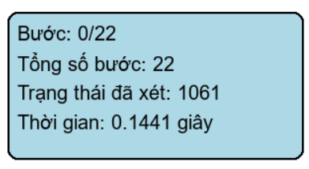

    *   **Greedy:**
    

    *   **IDA*:**
    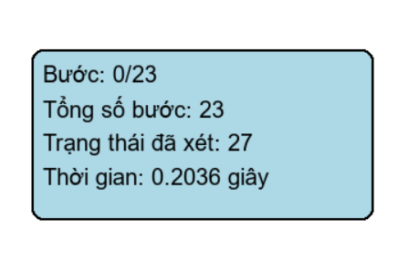

*   **Phân tích hiệu suất:**
    *   **Độ dài đường đi:**
        *   A*: 22 bước
        *   IDA*: 23 bướcbước
        *   Greedy: 79 bước
    *   **Số trạng thái đã duyệt:**
        *   Greedy: 123 trạng thái
        *   A*: 1061 trạng thái
        *   IDA*: 27 trạng thái
    *   **Thời gian thực thi:**
        *   Greedy: 0.0229 giây
        *   A*: 0.1441 giây
        *   IDA*: 0.2036 giây
    *   **Kết luận:** A* và IDA* có số bước gần như giống nhau trong khi Greedy thì có số bước lớn hơn. Nhưng trạng thái duyệt của IDA* và Greedy lại ít hơn rất nhiều so với A*. Tuy vậy, thời gian thực thi của Greedy lại thấp hơn rất nhiều so với IDA* và A*. 

#### 2.3. Tìm kiếm cục bộ (Local Search)

Các thuật toán trong nhóm này duy trì một hoặc một vài trạng thái hiện tại và di chuyển đến các trạng thái lân cận dựa trên một tiêu chí cải thiện. Chúng không ghi nhớ đường đi đầy đủ và có thể mắc kẹt ở cực tiểu cục bộ.

*   **Các thành phần cơ bản:**
    *   **Trạng thái:** Cấu hình hiện tại của bảng 8-Puzzle
    *   **Trạng thái ban đầu:** [[4, 1, 3], [0, 2, 5], [7, 8, 6]]
    *   **Trạng thái đích:** [[1, 2, 3], [4, 5, 6], [7, 8, 0]]
    *   **Các hành động:** Di chuyển ô trống (lên, xuống, trái, phải)
    *   **Hàm đánh giá:** Khoảng cách Manhattan từ trạng thái hiện tại đến đích

*   **Các thuật toán đã triển khai:**
    *   **Simple Hill Climbing:** Di chuyển đến trạng thái lân cận đầu tiên có giá trị hàm đánh giá tốt hơn trạng thái hiện tại. Thuật toán dừng khi không tìm thấy trạng thái lân cận tốt hơn.
    
    *   **Hill Climbing:** Di chuyển đến trạng thái lân cận có giá trị hàm đánh giá tốt nhất trong tất cả các trạng thái lân cận. Thuật toán dừng khi không tìm thấy trạng thái lân cận tốt hơn.
    
    *   **Stochastic Hill Climbing:** Chọn ngẫu nhiên một trạng thái lân cận tốt hơn từ danh sách các trạng thái lân cận tốt hơn. Thuật toán dừng khi không tìm thấy trạng thái lân cận tốt hơn.
    
    *   **Simulated Annealing:** Cho phép di chuyển đến trạng thái xấu hơn với xác suất giảm dần theo thời gian (nhiệt độ). Thuật toán bắt đầu với nhiệt độ cao và giảm dần theo thời gian. Xác suất chấp nhận trạng thái xấu hơn giảm dần theo nhiệt độ.
    *   **Beam Search:** Duy trì một tập hợp k trạng thái tốt nhất hiện tại và mở rộng chúng ở mỗi bước. Thuật toán chỉ giữ lại k trạng thái tốt nhất từ các trạng thái mới sinh ra.
    
    *   **Genetic Algorithm:** Sử dụng các nguyên lý của tiến hóa tự nhiên để tìm kiếm giải pháp. Thuật toán duy trì một quần thể các trạng thái, thực hiện các phép lai ghép và đột biến để tạo ra các trạng thái mới, và chọn lọc các trạng thái tốt nhất để tiếp tục quá trình.

*   **So sánh hiệu suất:**
    *   **Simple Hill Climbing:**
    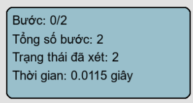

    *   **Hill Climbing:**
    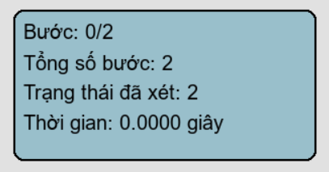

    *   **Stochastic Hill Climbing:**
    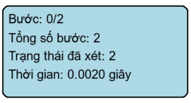

    *   **Beam Search:**
    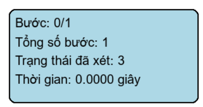

*   **Phân tích hiệu suất:**
    *   **Độ dài đường đi:**
        *   Simple HillClimbing, HillClimbing, Stochastic HillClimbing, Beam Search: 1 đến 2 bước
        *   Simulated Annealing, Genetic: Chương trình hiện thông báo không giải được
    *   **Số trạng thái đã xét:**
        *   Simple HillClimbing, HillClimbing, Stochastic HillClimbing: 2
        *   Beam Search: 3 
        *   Genetic, Stimulated: Không xác định
    *   **Thời gian thực thi:**
        *   Simple HillClimbing, Beam Search: 0.000 giây
        *   HillClimbing: 0.0115 giây
        *   Stochastic HillClimbing: 0.002 giây
    *   **Kết luận:** Các thuật toán Hill Climbing, Beam Search tìm được đường đi ngắn nhất (2 bước), trong khi Simulated Annealing và Genetic không thể giải được do số bước quá nhiều so với giới hạn được đặt ra trong chương trình. Các thuật toán Hill Climbing và Beam Search có khả năng và hiệu suất gần như là như nhau trong trường hợp dễ.

#### 2.4. Tìm kiếm trong môi trường phức tạp

Các thuật toán trong nhóm này được thiết kế để hoạt động trong các môi trường mà agent không có đầy đủ thông tin về trạng thái hiện tại.

##### 2.4.1. Tìm kiếm trên không gian niềm tin (Belief Space Search)

Các thuật toán trong nhóm này giải quyết các bài toán khi agent không biết chính xác trạng thái của mình, mà chỉ duy trì một tập hợp các trạng thái có thể (tập hợp niềm tin).

*   **Các thành phần cơ bản:**
    *   **Trạng thái niềm tin:** Tập hợp các trạng thái có thể của bảng 8-Puzzle
    *   **Trạng thái niềm tin ban đầu:** [[2, 6, 5], [0, 8, 7], [4, 3, 1]]
    *   **Các hành động:** Di chuyển ô trống (lên, xuống, trái, phải)
    *   **Mô hình chuyển đổi:** Quy tắc xác định tập hợp niềm tin mới sau mỗi hành động

*   **Thuật toán đã triển khai:**
    *   **No Observation (BFS):** Không nhận được thông tin phản hồi trong quá trình thực hiện. Thuật toán phải tìm một kế hoạch đảm bảo đạt đích mà không cần biết trạng thái cụ thể sau mỗi bước. Sử dụng BFS trên không gian niềm tin để tìm kế hoạch ngắn nhất.
    

* **Hiệu suất khi có 1 không gian niềm tin đích**
    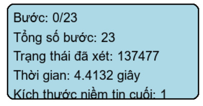

    *   **Kết luận**: KHi có 1 không gian niềm tin đích thì hiệu suất giống như BFS thông thường

##### 2.4.2. Tìm kiếm AND/OR (AOSearch)

Thuật toán thử nghiệm dựa trên logic AND/OR, áp dụng trực tiếp lên không gian trạng thái vật lý của bài toán 8-Puzzle.

*   **Mô tả logic:**
    *   Thuật toán duyệt qua không gian trạng thái bằng cách xen kẽ giữa các nút "OR" và nút "AND" theo độ sâu
    *   Nút OR: Thành công nếu một trong các nhánh con dẫn đến lời giải
    *   Nút AND: Thành công nếu tất cả các nhánh con dẫn đến lời giải
    *   Sử dụng cơ chế ngăn chặn chu trình trong đường đi khám phá

*   **Nhận xét:**
    *   Đây là một cách áp dụng không chuẩn mực của khái niệm AND/OR Search cho bài toán tìm kiếm đường đi tuyến tính
    *   Do bản chất của logic AND và cách xây dựng đường đi không phù hợp với cấu trúc bài toán 8-Puzzle, thuật toán này không đảm bảo tìm được lời giải hợp lệ hoặc tối ưu
    *   Hiệu suất (thời gian, số nút duyệt) có thể biến động và thường không hiệu quả so với các thuật toán tìm kiếm trạng thái chuẩn mực

#### 2.5. Tìm kiếm có ràng buộc (Constraint Satisfaction Problems - CSP)

Mặc dù bài toán 8-Puzzle tìm đường đi không phải là CSP điển hình, các khái niệm và thuật toán CSP có thể được áp dụng cho các vấn đề liên quan như tạo cấu hình bàn cờ hợp lệ và tìm trạng thái bắt đầu có thể giải được.

*   **Các thành phần cơ bản:**
    *   **Biến:** 9 ô trên bàn cờ 8-Puzzle
    *   **Miền giá trị:** {0, 1, 2, 3, 4, 5, 6, 7, 8} cho mỗi ô
    *   **Ràng buộc:** Mỗi số từ 0 đến 8 phải xuất hiện duy nhất một lần

*   **Các thuật toán đã triển khai:**
    *   **Backtracking:** Thuật toán quay lui để sinh ra các hoán vị hợp lệ của bàn cờ.
    
        *   **Hiệu suất**:
        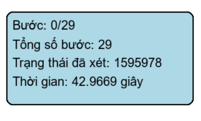
    *   **AC3 (Arc Consistency Algorithm 3):** Thuật toán được triển khai với các thành phần chính:
        - Sử dụng một hàng đợi (deque) để lưu trữ các cặp biến cần kiểm tra
        - Hàm revise() kiểm tra và loại bỏ các giá trị không nhất quán từ miền giá trị của biến
        - Hàm constraints_func() xác định ràng buộc giữa các biến (các số phải khác nhau)
        - Thuật toán lặp lại việc kiểm tra và cập nhật cho đến khi không còn thay đổi nào
        - Sử dụng draw_current_domains() để hiển thị trực quan quá trình cập nhật miền giá trị
        - Có giới hạn số lần thử (max_attempts) để tránh vòng lặp vô tận
    *   **Testing:** Thuật toán được triển khai với các đặc điểm:
        - Sử dụng BFS để duyệt qua các trạng thái có thể
        - Mỗi trạng thái được biểu diễn bằng ma trận 3x3
        - Duy trì một danh sách các giá trị đã gán (assigned_values) để đảm bảo tính duy nhất
        - Sử dụng draw_current() để hiển thị trực quan quá trình gán giá trị
        - Có giới hạn số lần thử (max_attempts) để tránh vòng lặp vô tận
        - Kiểm tra tính hợp lệ của trạng thái bằng cách so sánh với trạng thái đích
*   **Note**: Thuật toán AC3 và Testting có thời gian thực thi rất lâu trạng thái đầu và trạng thái đích
    *   **Trạng thái ban đầu:** [[2, 6, 5], [0, 8, 7], [4, 3, 1]]
    *   **Trạng thái đích:** [[1, 2, 3], [4, 5, 6], [7, 8, 0]]

## KẾT LUẬN

### 1. So sánh hiệu suất các thuật toán

1. **Tìm kiếm không có thông tin:**
   - BFS và UCS cho kết quả tốt nhất với đường đi ngắn nhất (22 bước)
   - IDS có thời gian thực thi lâu nhất do phải lặp lại nhiều lần DFS
   - DFS có số bước lớn nhất (48 bước) nhưng thời gian thực thi nhanh hơn

2. **Tìm kiếm có thông tin:**
   - A* và IDA* cho kết quả tốt nhất với đường đi ngắn (22-23 bước)
   - Greedy có số bước lớn (79 bước) nhưng thời gian thực thi nhanh nhất
   - IDA* có số trạng thái duyệt ít nhất (27 trạng thái)

3. **Tìm kiếm cục bộ:**
   - Các thuật toán Hill Climbing và Beam Search hiệu quả với bài toán dễ
   - Simulated Annealing và Genetic Algorithm không hiệu quả với bài toán phức tạp
   - Thời gian thực thi rất nhanh (0.000-0.0115 giây) cho các bài toán đơn giản

### 2. Ưu điểm và hạn chế

1. **Ưu điểm:**
   - Hệ thống cung cấp giao diện trực quan để theo dõi quá trình giải
   - Đa dạng các thuật toán cho phép so sánh hiệu suất
   - Có khả năng xử lý các bài toán với không gian niềm tin
   - Hỗ trợ nhiều phương pháp tìm kiếm khác nhau

2. **Hạn chế:**
   - Một số thuật toán (AC3, Testing) có thời gian thực thi lâu
   - Các thuật toán tìm kiếm cục bộ dễ bị kẹt ở cực tiểu cục bộ
   - Chưa tối ưu hóa bộ nhớ cho các bài toán lớn
   - Giới hạn về độ phức tạp của bài toán có thể giải quyết

### 3. Hướng phát triển

1. **Cải thiện hiệu suất:**
   - Tối ưu hóa các thuật toán có thời gian thực thi lâu
   - Thêm các kỹ thuật cắt tỉa để giảm không gian tìm kiếm
   - Cải thiện hàm heuristic cho các thuật toán có thông tin

2. **Mở rộng tính năng:**
   - Thêm các thuật toán tìm kiếm mới
   - Hỗ trợ các bài toán với kích thước lớn hơn
   - Tích hợp các kỹ thuật học máy để cải thiện hiệu suất

3. **Cải thiện giao diện:**
   - Thêm các công cụ phân tích hiệu suất chi tiết
   - Cải thiện trực quan hóa quá trình tìm kiếm
   - Thêm tùy chọn cấu hình cho các thuật toán

## TÁC GIẢ
Võ Hữu Tín-23110343

